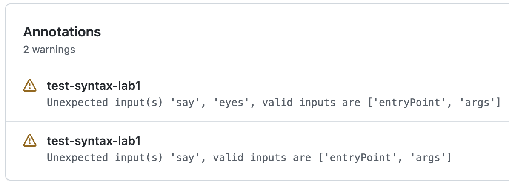
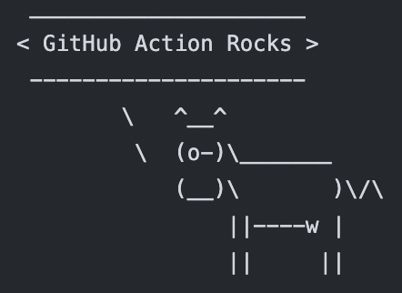

# Lab 1

Create an Action using Docker container taking inputs to serve as **cowsay** arguments

## Tips

- Github Action syntax for [Runs](https://docs.github.com/en/actions/creating-actions/metadata-syntax-for-github-actions#runs-for-docker-container-action) in Docker container action
- Cowsay [manual page](https://linux.die.net/man/1/cowsay)

## Setup

Create a repository with the content of this folder.

`testing-workflow.yaml` will run but display some warnings.

## Remove the warnings

- Add a required input to tell the cow what to say
- Add an optional input to set the eyes of the cow (default to `oo`)
- Pass them as args to the docker image

## Finish

`testing-workflow.yaml` will run without warning and the step will display the cow saying what you set up.

Use the `action.yaml` from the [solution](https://github.com/sfeir-open-source/sfeir-school-github-action-dev/tree/v1/steps/10-syntax-lab1-action-input-solution) to compare it with your solution.
