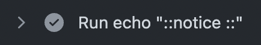
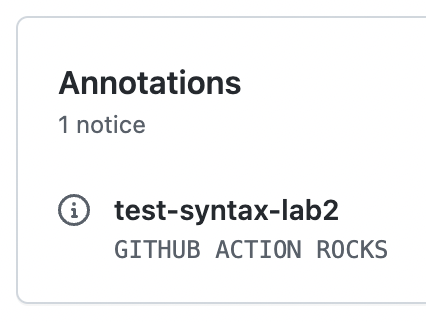

# Lab 2

Create a Composite Action to output the input text as **Uppercase** value

## Tips

- Github Action syntax for [outputs](https://docs.github.com/en/actions/creating-actions/metadata-syntax-for-github-actions#outputs-for-composite-actions) in Composite action
- Shell Parameter expansion [documentation](https://www.gnu.org/software/bash/manual/html_node/Shell-Parameter-Expansion.html)
- Use `env` to pass inputs into `runs` command
  
  ```yaml
  env:
    INPUT_VALUE: ${{ inputs.value }}
  ```

## Setup

Create a repository with the content of this folder.

`testing-workflow.yaml` will run but **NOT** display any notice message since the message is empty.



## Remove the warnings

On the action

- In the `upper_step` step, set the uppercase value as output of the step
- Add `upper_text` as action output the uppercase value from the step `upper_step`

## Finish

`testing-workflow.yaml` will run and display the notice message as expected.



Use the `action.yaml` from the [solution](https://github.com/sfeir-open-source/sfeir-school-github-action-dev/tree/v1/steps/10-syntax-lab2-action-output-solution) to compare it with your solution.
