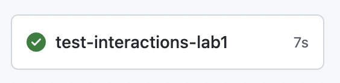
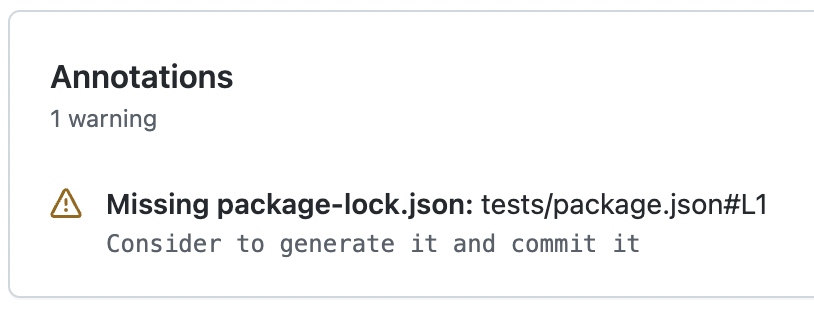

# Lab 1

**Declare a warning** if a package-lock.json is missing

## Tips

- [@actions/glob](https://www.npmjs.com/package/@actions/glob) npm documentation
- [@actions/core](https://www.npmjs.com/package/@actions/core) npm documentation
- [Iterate over an array](https://developer.mozilla.org/fr/docs/Web/JavaScript/Reference/Global_Objects/Array/forEach) in JavaScript
- Test if a [file exists](https://nodejs.org/docs/latest-v16.x/api/fs.html#fsaccesspath-mode-callback) in Node.js

## Setup

Create a repository with the content of this folder.

`testing-workflow.yaml` will run and do **NOT** print any warning (on the `tests/package.json` file)



### Find all package.json

In the `index.js` file, use the `@actions/glob` module to get all `package.json` files in the current directory.

⚠️ You may want to exclude the `package.json` files from `node_modules`, check the `@actions/glob` documentation.

### Check if the associated package-lock.json exists and create a warning annotation if not

For each of the `package.json` files found, check if the associated `package-lock.json` exists using this code snippet

```js
const path = require('path');
const fs = require('fs');

files.forEach(file => {
  try {
    fs.accessSync(path.join(path.dirname(file), 'package-lock.json'));
  } catch (err) {
    // File don't exists
  }
});
```

If the file don't exists, then define a [Warning annotation](https://github.com/actions/toolkit/tree/main/packages/core#annotations) on the `package.json` file.

- Message = `Consider to generate it and commit it`
- Title = `Missing package-lock.json`

## Finish

`testing-workflow.yaml` will run and produce a warning on the `tests/package.json` since the `package-lock.json` file is missing.



Use the `action.yaml` and the `package.json` from the [solution](https://github.com/sfeir-open-source/sfeir-school-github-action-dev/tree/v1/steps/20-interactions-lab1-warning-solution) to compare it with your solution.
