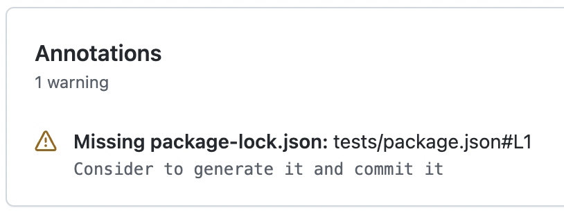
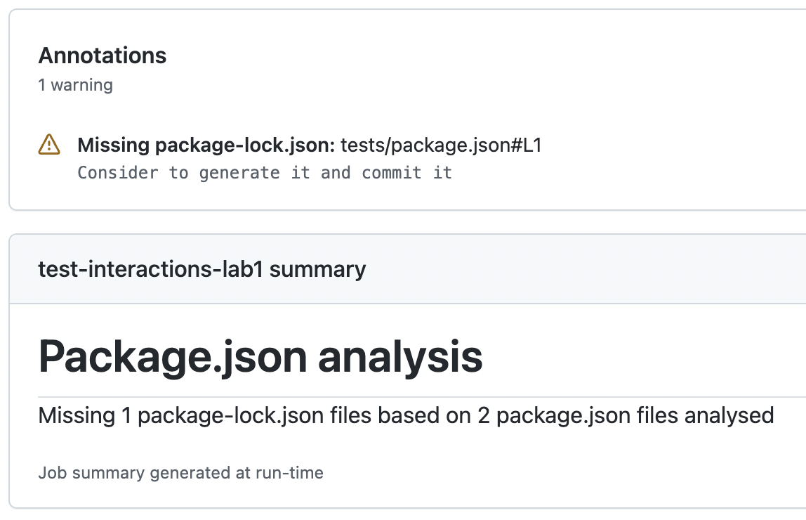

# Lab 2

Set **Job summary** with the stats about missing package-lock.json analysis (based on Lab 1).

## Tips

- [Add an heading](https://github.com/actions/toolkit/blob/main/packages/core/src/summary.ts#L298-L305) to Job summary
- [Add a line](https://github.com/actions/toolkit/blob/main/packages/core/src/summary.ts#L177-L180) to Job summary

## Setup

Create a repository with the content of this folder.

`testing-workflow.yaml` will run and do **NOT** set any Job summary, only the warning from the previous lab.



### Get some stats

In the `index.js` file, gather the following stats

- **analysedPackageJsonCount** : the count of `package.json` files analysed
- **missingPackageLockJsonCount**: the count of missing `package-lock.json` found

### Display the stats as Job summary

In the `index.js` file, use the stats to display in the Job summary the following data

- As heading

  ```text
  Package.json analysis
  ```

- As simple line if no package.json was found

  ```text
  No package.json found
  ```

- As simple line if all package-lock.json are found

  ```text
  No missing package-lock.json files based on ${analysedPackageJsonCount} package.json files analysed
  ```

- As simple line if some package-lock.json are missing

  ```text
  Missing ${missingPackageLockJsonCount} package-lock.json files based on ${analysedPackageJsonCount} package.json files analysed
  ```

## Finish

`testing-workflow.yaml` will run and display the following Job summary in addition with the warning from the previous lab.



Use the `index.js` from the [solution](https://github.com/sfeir-open-source/sfeir-school-github-action-dev/tree/v1/steps/20-interactions-lab2-summary-solution) to compare it with your solution.
