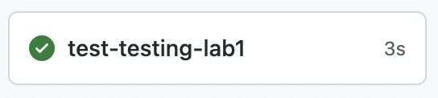
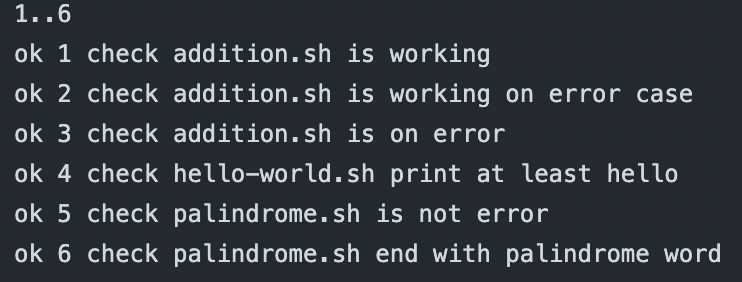

# Lab 1

Test **shell** scripts using **bats**.

## Tips

- Github Action syntax for [Runs](https://docs.github.com/en/actions/creating-actions/creating-a-composite-action) in Composite action
- [actions/checkout](https://github.com/actions/checkout) documentation
- bats [manual page](https://bats-core.readthedocs.io/en/stable/writing-tests.html#libraries-and-add-ons)

## Setup

Create a repository with the content of this folder.

`testing-workflow.yaml` will run and do **nothing** (yet).



## Run the tests

- Setup `bats`, `bats-assert`, and `bats-support` as git submodules
  
  ```shell
  git submodule add https://github.com/bats-core/bats-core.git tests/bats
  git submodule add https://github.com/bats-core/bats-assert.git tests/test_helper/bats-assert
  git submodule add https://github.com/bats-core/bats-support.git tests/test_helper/bats-support
  ```

- Make `testing-workflow.yaml` load the git submodules
- Run the `lab-tests.bats` file using `bats` from the `testing-workflow.yaml`

## Test the addition script

- Add a test that check if `addition.sh` is working : 5 + 5 eq 10
- Add a test that check if `addition.sh` is working : missing arg throw an error
- Add a test that check if `addition.sh` is working : returned exit code is `3`

## Test the hello-world script

- Add a test that check if `hello-world.sh` print at least `Hello` and not `Hola`

## Test the palindrome script

- Add a test that check if `palindrome.sh` is not error with the word `kayak` and the output contains : `is a palindrome`
- Add a test that check if `palindrome.sh` end with the word `palindrome` with a regex

## Finish

`testing-workflow.yaml` will run the 6 tests without failure.



Use the `testing-workflow.yaml` and the `lab-tests.bats` from the [solution](https://github.com/sfeir-open-source/sfeir-school-github-action-dev/tree/main/steps/30-testing-lab1-action-shell-testing-solution) to compare it with your solution.
