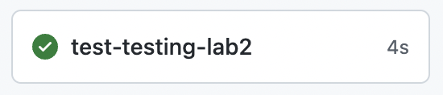
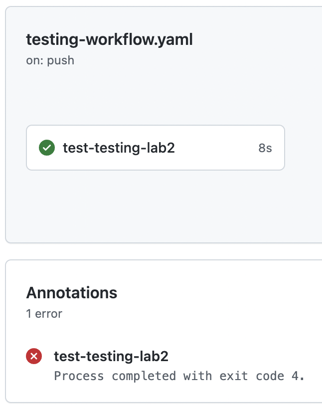

# Lab 2

Test an **Action** using a GitHub Action **workflow**.

## Tips

- [test](https://www.man-linux-magique.net/man1/test.html) command

## Setup

Create a repository with the content of this folder.

`testing-workflow.yaml` will run and do **nothing** (yet).

## Steps

- Create a repository
- Add the file `release-workflow.yml` which will serve you to run the lab
- update `testing-workflow.yml` to test that our action output the following value : 
  - `4 + 5` equals 9 
  - `ab` + `cd` equals 0
  - the hello-world script return `Hello World!`
  - `kayak` is a palindrome 
  - `foo` is not a palindrome 

## Test the addition part

- Run the action to add `4` to `5` and test the `addition` output to be equals to `9`
- Run the action to add `ab` to `bc` and test that the action run have fail

## Test the hello-world part

- Run the action and test the `hello world` output to be equals to `Hello World!`

## Test the palindrome part

- Run the action with `kayak` and test the `palindrome` output to be equals to `kayak is a palindrome`
- Run the action with `foo` and test the `palindrome` output to be equals to `foo is not a palindrome`

## Finish

`testing-workflow.yaml` will run the 5 tests without failure and display a warning for the `error` test case

Use the `testing-workflow.yaml` from the [solution](https://github.com/sfeir-open-source/sfeir-school-github-action-dev/tree/main/steps/30-testing-lab2-action-workflow-testing-solution) to compare it with your solution.
