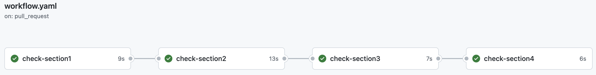
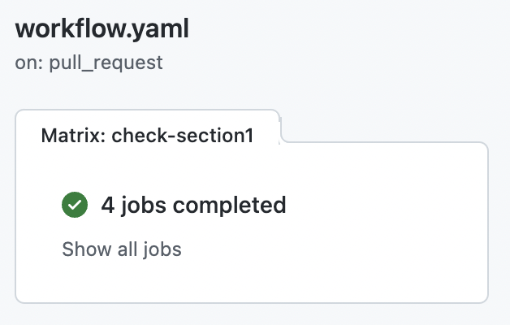

# Lab 1

Use **reusable workflow** and **action** to improve **maintainability** of a workflow.

## Tips

- [Reusable Workflow](https://docs.github.com/en/actions/using-workflows/reusing-workflows) documentation
- [Composite Action](https://docs.github.com/en/actions/creating-actions/creating-a-composite-action) documentation
- GitHub Action [Matrix](https://docs.github.com/en/actions/using-jobs/using-a-matrix-for-your-jobs) syntax

## Setup

Create a repository with the content of this folder.

`workflow.yaml` will run and validate the markdown of the documentation sections sequentially.

## Initiate a pull request

The workflow work on a `pull_request` trigger,

- Update some markdown and create a Pull request to check if your new markdown pass the linter validation.

## Introduce a Matrix to the workflow

Watching the workflow, you may see some redunduncies,

- Remove unneccessary link between job
- Introduce a matrix to replace the duplication of code

## Extract code to a reusable worklow

> One team of your entreprise want to copy your workflow to validate its documentation.

Split the configuration of the documentation validation from the documentation validation itself.

- The reusable workflow take as input the directory to check

This way, the team and yours will share the same process without duplication

## Extract lint into a action

> Another team want to check its documentation markdown but not in the same process as yours.

Extract the markdown lint process into an action named `markdown-linter`

- The action take as input the directory to lint
- The action output the linter report without transformation
- The reusable workflow use the action instead of the markdown lint step
- The reusable workflow use the report to prepare the comment message

This way, any team can check markdown file and act on it in theirs own way.

## Finish

- `workflow.yaml` will run and validate the markdown of the documentation sections in parallel.

  

- `reusable-workflow.yaml` will be reusable by other teams with the same process.
- `markdown-linter` action will be usable by other teams with a different process.

Use the `workflow.yaml`, the `reusable-workflow.yaml`, and the `action.yaml` from the [solution](https://github.com/sfeir-open-source/sfeir-school-github-action-dev/tree/main/steps/40-reuse-lab1-maintainability-solution) to compare it with your solution.
