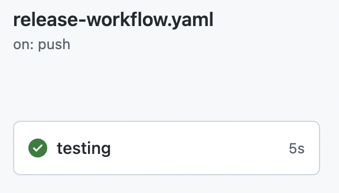
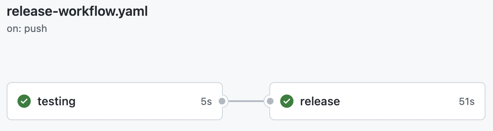

# Lab 1

Create a new repository and **release it**, then **publish it** to the marketplace.

## Tips

- [Semantic Release Action](https://github.com/cycjimmy/semantic-release-action)
- GitHub Action workflow syntax : [needs](https://docs.github.com/en/actions/using-workflows/workflow-syntax-for-github-actions#jobsjob_idneeds)
- [Publishing to the marketplace](https://docs.github.com/en/actions/creating-actions/publishing-actions-in-github-marketplace)

## Setup

Create a repository with the content of this folder.

`release-workflow.yaml` will run but do **NOT** generate a release.



## Release it

- Create a second job `release` which needs the `testing` job to be successful
- Run the `semantic release` throught its action on repository sources

⚠️ Be vigilant on the default branch naming, semantic release only accept a set of branches to run on.

## Publish it

- Add required syntax to the `action.yaml` file to publish on the Marketplace
- Edit latest release to publish it
  - Fix any marketplace publication errors
  - Choose one or two categories as you want (not relevant to this lab)
- Search for your action on the Marketplace

## Test it

Create a new workflow `testing-workflow.yaml` to test your action from an user point of view
  
  ```yaml
  name: Testing your public action
  on: push
  jobs:
    testing:
      runs-on: ubuntu-latest
      steps:
        - uses: you/your-action@v1.x.x
  ```

## Teardown
  
⚠️ Do not forget to `unpublish` this action at the end of the Lab.

## Finish

`release-workflow.yaml` will run and generate a new release based on the commit history.



Use the `release-workflow.yaml`, the `.releaserc`, and the `action.yaml` from the [solution](https://github.com/sfeir-open-source/sfeir-school-github-action-dev/tree/v1/steps/50-lifecycle-lab1-marketplace-solution) to compare it with your solution.
