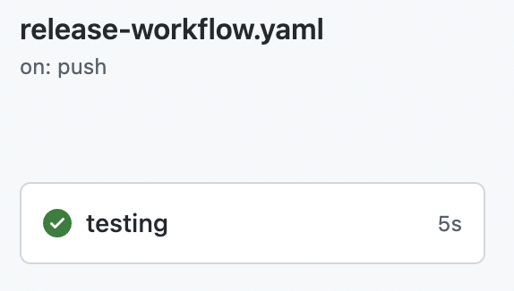
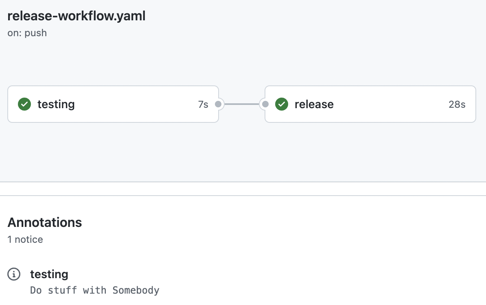

# Lab 2

Manage the **compiled files** on an JavaScript Action

## Tips

- Semantic Release [exec plugin](https://github.com/semantic-release/exec)
- [Run npm command](https://docs.npmjs.com/cli/v8/commands/npm-run-script)
- [Install package dependencies](https://docs.npmjs.com/cli/v8/commands/npm-install)

## Setup

Create a repository with the content of this folder.

`release-workflow.yaml` will run but will fail due to the content.



### Difference with Lab 1

This Lab use the result of Lab 1 and add feature the JS action which required compilation now

- `action.yaml` declare a new input `who`
  - and use the generated `index.js` from the `dist` folder
- `index.js` use the `core` toolkit to access the input
  - and push an `notice` message instead of a console log
- `package.json` declare `core` toolkit as dependencies
  - and a `prepare` command to compile the `index.js` file into a `dist` folder

## Release it with dist file

- On the testing workflow, when needed
  - Install package dependencies
  - Run the `prepare` command
- Add the generated `dist` folder to the release

## Test it

Create a new workflow `testing-workflow.yaml` to test your action from an user point of view
  
  ```yaml
  name: Testing your public action
  on: push
  jobs:
    testing:
      runs-on: ubuntu-latest
      steps:
        - uses: you/your-action@v1.x.x
  ```

## Finish

`release-workflow.yaml` will run and generate a new release with the compiled files.



Use the `release-workflow.yaml` and the `.releaserc` from the [solution](https://github.com/sfeir-open-source/sfeir-school-github-action-dev/tree/v1/steps/50-lifecycle-lab2-dist-solution) to compare it with your solution.
